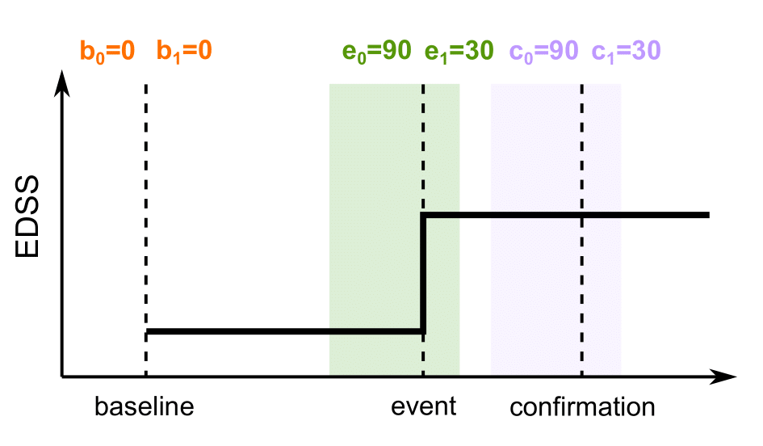
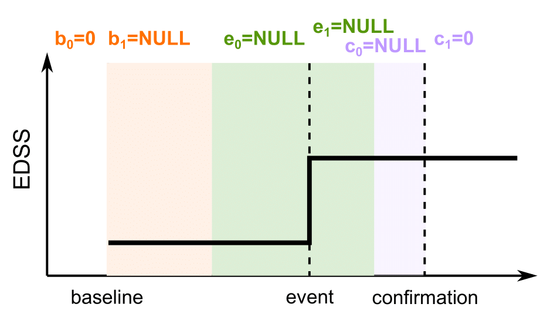
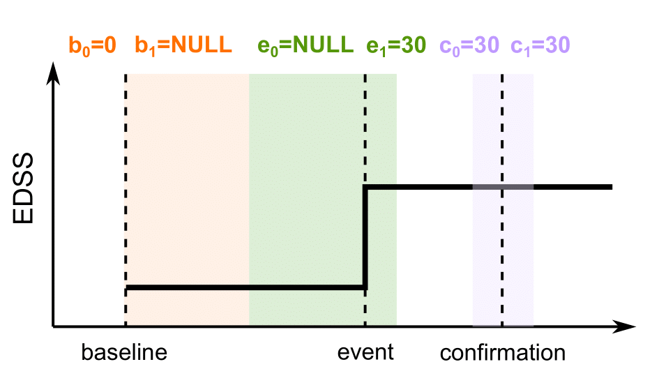
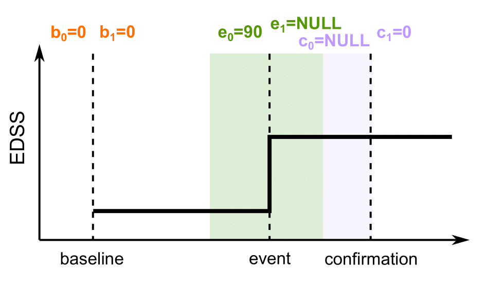

```{r setup, include=FALSE}
knitr::opts_chunk$set(
  collapse=TRUE,
  comment="#>"
)
```

This vignette illustrates how to use the `msprog` package to study disability progression independent of relapse activity (PIRA) in multiple sclerosis (MS). For a more general introduction on `msprog` package usage for disability progression assessment, please refer to the vignette *Analysing disability course in MS*. 

```{r, echo=FALSE}
library(msprog)
```

## Defining PIRA

Recent studies [@kappos2018; @silent2019; @kuhlmann2023] have highlighted the contribution of PIRA to overall progression, generating growing interest in PIRA as a relevant endpoint. Classifying a progression event as relapse-independent requires careful observation of its relative timing with respect to relapses. Established definitions of PIRA require the absence of relapses within appropriate intervals based on the dates of the reference visit, the disability progression event, and the confirmation visit [@kappos2020; @cagol2022; @muller2023]. Such an approach is easily integrated into the `msprog::MSprog` function through its argument `relapse_indep`, allowing to specify custom relapse-free intervals. The argument must be provided in the form produced by function `msprog::relapse_indep_from_bounds()`, as follows:
``` {r, eval=FALSE}
output <- MSprog(...
                 relapse_indep=relapse_indep_from_bounds(b0, b1, e0, e1, c0, c1),
                 ...)
```
where: `b0` and `b1` specify the interval around the baseline visit; `e0` and `e1` specify the interval around the event; `c0` and `c1` specify the interval around the confirmation visit; see Figure 1. If the right end (`b1` or `e1`) is `NULL`, the interval is assumed to extend up to the left end of the next interval. If the left end is `NULL`  (`e0` or `c0`), the interval is assumed to extend up to the right end of the previous interval. 

```{r echo=FALSE, dpi=250, fig.cap = "*Figure 1. Relapse-free intervals characterising PIRA, as defined by arguments `b0`, `b1`, `e0`, `e1`, `c0`, `c1`.*"}
knitr::include_graphics(paste0(getwd(), 'relapse_indep_def.png'))
```

<br/ >
Some examples are provided below.
<br/ >

* In @muller2023, the authors recommend an absence of relapses during the 90 days before and 30 days after the event, and during the 90 days before and 30 days after the confirmation visit for a progression event to be considered as PIRA. This translates into:
  ``` {r}
  relapse_indep <- relapse_indep_from_bounds(0,0,   # baseline
                                            90,30, # event
                                            90,30) # confirmation
  ```
  
  ```{r echo=FALSE, dpi=250, fig.cap = "*Figure 2. Relapse-free intervals as recommended in @muller2023.*"}
  
  ```
  <br/ >
  
* When a high specificity is desired, they recommend an absence of relapses in the whole period between the reference visit and the confirmation visit, which is implemented as:
  ``` {r}
  relapse_indep <- relapse_indep_from_bounds(0,NULL,    # baseline
                                            NULL,NULL, # event
                                            NULL,0)    # confirmation
  ```
  
  ```{r echo=FALSE, dpi=250, fig.cap = "*Figure 3. Relapse-free intervals as recommended in @muller2023 for high specificity.*"}
  
  ```
  <br/ >
  
* In @kappos2020, an absence of relapses was required between the reference visit and 30 days after the event, and during the 30 days before and 30 days after the confirmation visit:
  ``` {r}
  relapse_indep <- relapse_indep_from_bounds(0,NULL,  # baseline
                                            NULL,30, # event
                                            30,30)   # confirmation
  ```
  
  ```{r echo=FALSE, dpi=250, fig.cap = "*Figure 4. Relapse-free intervals as used in @kappos2020.*"}
  
  ```
  <br/ >
  
* In @cagol2022, the authors required an absence of relapses during the 90 days before the progression event and between the progression event and the confirmation visit:
  ``` {r}
  relapse_indep <- relapse_indep_from_bounds(0,0,     # baseline
                                            90,NULL, # event
                                            NULL,0)  # confirmation
  ```
  
  ```{r echo=FALSE, dpi=250, fig.cap = "*Figure 5. Relapse-free intervals as used in @cagol2022.*"}
  
  ```
  <br/ >
  

The requirement of relapse-free periods is often coupled with a non-fixed baseline scheme. This can be a roving baseline, where the reference value is updated after every confirmed improvement or progression event, as in @muller2023 (`baseline='roving'` in `MSprog()`); or a re-baseline after the onset of each relapse, as in @kappos2020 (`relapse_rebl=TRUE` in `MSprog()`).

## Detecting PIRA

To illustrate how to apply the above definitions when computing disability progression from patient data, we use the toy data provided in the `msprog` package. These include artificially generated EDSS and SDMT assessments (`toydata_visits`) and relapse dates (`toydata_relapses`) for four patients:
```{r}
data(toydata_visits)
data(toydata_relapses)
head(toydata_visits)
head(toydata_relapses)
```

<br />

The following code detects, for each subject in the toy dataset, the first EDSS PIRA event (`event=firstPIRA`) confirmed over $\geq$ 12 or $\geq$ 24 weeks (`conf_weeks=c(12,24)`, `conf_tol_days=0`, `conf_unbounded_right=TRUE`), for two different definitions of PIRA. We set `verbose=2` to print an extended log of the computations performed.

* Roving baseline, and absence of relapses during the 90 days before and 30 days after the event, and during the 90 days before and 30 days after the confirmation @muller2023:
  ```{r}
  output <- MSprog(toydata_visits, 'id', 'EDSS', 'date', 'edss',
                 relapse=toydata_relapses, 
                 conf_weeks=c(12,24), conf_tol_days=0, conf_unbounded_right=TRUE,
                 event='firstPIRA', baseline='roving',
                 relapse_indep=relapse_indep_from_bounds(0,0,90,30,90,30),
                 verbose=2)
  print(output$results, row.names=FALSE) # results
  ```

* Post-relapse re-baseline, and absence of relapses between the reference visit and 30 days after the event, and during the 30 days before and 30 days after the confirmation @kappos2020:
  ```{r}
  output <- MSprog(toydata_visits, 'id', 'EDSS', 'date', 'edss',
                 relapse=toydata_relapses,
                 conf_weeks=c(12,24), conf_tol_days=0, conf_unbounded_right=TRUE,
                 event='firstPIRA', baseline='fixed', relapse_rebl=TRUE,
                 relapse_indep=relapse_indep_from_bounds(0,NULL,NULL,30,30,30),
                 verbose=2)
  print(output$results, row.names=FALSE) # results
  ```

Here, `nevent` is the cumulative event count for each subject, and `event_type` characterises the event (since `event` is set to `firstPIRA`, the count is either 0 or 1 and the event type, when present, is always `PIRA`); `time2event` is the number of days from start of follow-up to event; `bl2event` is the number of days from current baseline to event; `conf12` and `conf24` report whether the event was confirmed over 12 or 24 weeks; `sust_days` is the number of days for which the event was sustained; `sust_last` reports whether the event was sustained until the last visit.

## References


