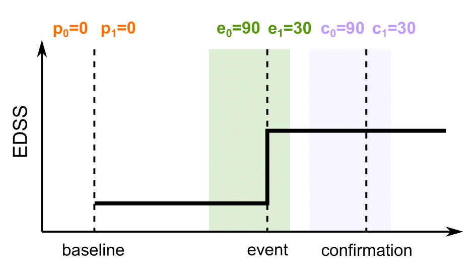
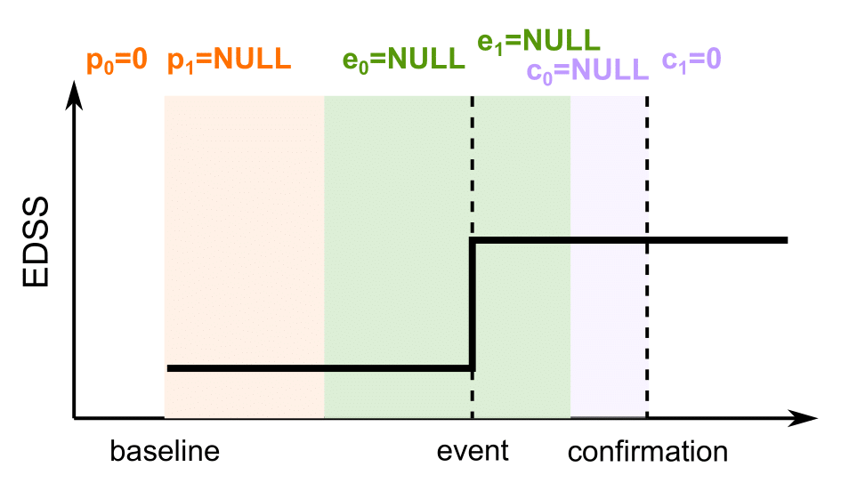
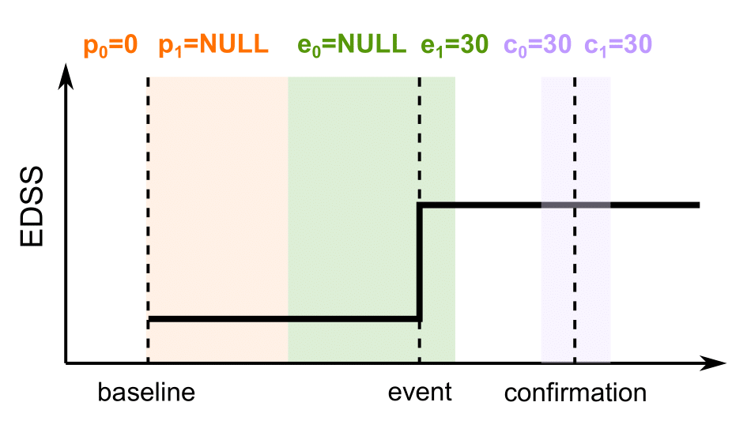
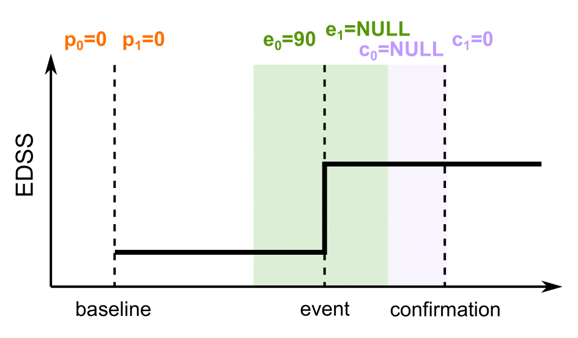

```{r setup, include=FALSE}
knitr::opts_chunk$set(
  collapse=TRUE,
  comment="#>"
)
```

This vignette illustrates how to use the `msprog` package to study disability **progression independent of relapse activity (PIRA)** in multiple sclerosis (MS). For a more general introduction on `msprog` package usage for disability course assessment, please refer to the vignette *Analysing disability course in MS*.

```{r, echo=FALSE}
library(msprog)
```

<!-- ```{r} -->
<!-- source('/Users/nmontobbio/code/MSprog/R-MSprog/msprog/R/MSprog.R') -->
<!-- source('/Users/nmontobbio/code/MSprog/R-MSprog/msprog/R/event_testing.R') -->
<!-- source('/Users/nmontobbio/code/MSprog/R-MSprog/msprog/R/relapse_indep_from_bounds.R') -->
<!-- source('/Users/nmontobbio/code/MSprog/R-MSprog/msprog/R/msprog_methods.R') -->
<!-- load('/Users/nmontobbio/code/MSprog/R-MSprog/msprog/data/toydata_visits.RData') -->
<!-- load('/Users/nmontobbio/code/MSprog/R-MSprog/msprog/data/toydata_relapses.RData') -->
<!-- library(dplyr) -->
<!-- ``` -->

## Defining PIRA

Recent studies [@kappos2018; @silent2019; @kuhlmann2023] have highlighted the contribution of PIRA to overall disability worsening, generating growing interest in PIRA as a relevant endpoint. Classifying a confirmed disability worsening (CDW) event as relapse-independent requires careful observation of its relative timing with respect to relapses. Established definitions of PIRA [@kappos2020; @cagol2022; @muller2023] require the absence of relapses within appropriate intervals anchored to the dates of three main checkpoints:

1. a visit preceding the event: can be (i) the current reference, (ii) the last visit before the event,
or (iii) the last pre-worsening visit (`i` such that `outcome[event] - outcome[i] >= delta_fun(outcome[i])`)[^extrema];
2. the disability worsening event;
3. the (first) confirmation visit.

[^extrema]: if `skip_local_extrema` is not `none` in `msprog::MSprog()`, local extrema are not selected as "last pre-worsening visit".

For example, in @kappos2020, an absence of relapses was required between the reference visit and 30 days after the event, and during the 30 days before and 30 days after the confirmation visit for a CDW event to be considered as PIRA; in @cagol2022, the authors required an absence of relapses during the 90 days before the event and between the event and the confirmation visit; in @muller2023, the authors recommend an absence of relapses during the 90 days before and 30 days after the event, and during the 90 days before and 30 days after the confirmation visit; when a high specificity is desired, they recommend an absence of relapses in the whole period between the reference visit and the confirmation visit; in @muller2025, the authors recommend an absence of relapses since the last visit preceding the event (up to the event).

Such an approach is easily integrated into the `msprog::MSprog()` function through its argument `relapse_indep`, allowing to specify custom relapse-free intervals based on *any subset* of the checkpoints 1-3, thus allowing to replicate any of the above-mentioned definitions. The `relapse_indep` argument must be provided in the form produced by function `msprog::relapse_indep_from_bounds()`, as follows:
``` {r, eval=FALSE}
output <- MSprog(...
                 relapse_indep=relapse_indep_from_bounds(p0, p1, e0, e1, c0, c1, prec_type, use_end_dates),
                 ...)
```
where: `p0` and `p1` specify the interval around the preceding visit; `e0` and `e1` specify the interval around the event; `c0` and `c1` specify the interval around the confirmation visit; see Figure 1. If the right end (`p1` or `e1`) is `NULL`, the interval is assumed to extend up to the left end of the next interval. If the left end is `NULL`  (`e0` or `c0`), the interval is assumed to extend up to the right end of the previous interval. The `prec_type` argument specifies which preceding visit to take into account (`'baseline'` for current reference, `'last'` for last visit preceding the event, `'last_lower'` for last visit `i` such that `outcome[event] - outcome[i] >= delta_fun(outcome[i])`).[^enddates]

[^enddates]: If **end dates** of relapses are available (may be provided as an additional column in the relapse file whose name is specified by argument `renddate_col` in `MSprog()`), the `use_end_dates` argument in `relapse_indep_from_bounds()` controls whether they are used for PIRA or not. The default is `use_end_dates=F`. If `use_end_dates=T`, the provided intervals are ignored and PIRA is defined by the event or the confirmation not falling within the duration (onset to end) of a relapse. 

```{r echo=FALSE, out.width="50%", fig.cap = "*Figure 1. Relapse-free intervals characterising PIRA, as defined by arguments `p0`, `p1`, `e0`, `e1`, `c0`, `c1`.*"}
knitr::include_graphics(paste0(getwd(), 'relapse_indep_def.png'))
```

<br/ >
Some examples are provided below.
<br/ >

* No relapses during the 90 days before and 30 days after the event, and during the 90 days before and 30 days after the confirmation visit [@muller2023]:
  ``` {r}
  relapse_indep <- relapse_indep_from_bounds(p0=0, p1=0,   # baseline
                                            e0=90, e1=30, # event
                                            c0=90, c1=30) # confirmation
  ```
  
  ```{r echo=FALSE, out.width="50%", fig.cap = "*Figure 2. Relapse-free intervals as recommended in @muller2023.*"}
  
  ```
  <br/ >
  
* No relapses in the whole period between the reference visit and the confirmation visit [@muller2023]:
  ``` {r}
  relapse_indep <- relapse_indep_from_bounds(p0=0, p1=NULL,    # baseline
                                            e0=NULL, e1=NULL, # event
                                            c0=NULL, c1=0)    # confirmation
  ```
  
  ```{r echo=FALSE, out.width="50%", fig.cap = "*Figure 3. Relapse-free intervals as recommended in @muller2023 for high specificity.*"}
  
  ```
  <br/ >
  
* No relapses was required between the reference visit and 30 days after the event, and during the 30 days before and 30 days after the confirmation visit [@kappos2020]:
  ``` {r}
  relapse_indep <- relapse_indep_from_bounds(p0=0, p1=NULL,  # baseline
                                            e0=NULL, e1=30, # event
                                            c0=30, c1=30)   # confirmation
  ```
  
  ```{r echo=FALSE, out.width="50%", fig.cap = "*Figure 4. Relapse-free intervals as used in @kappos2020.*"}
  
  ```
  <br/ >
  
* No relapses during the 90 days before the event and between the event and the confirmation visit [@cagol2022]:
  ``` {r}
  relapse_indep <- relapse_indep_from_bounds(p0=0, p1=0,     # baseline
                                            e0=90, e1=NULL, # event
                                            c0=NULL, c1=0)  # confirmation
  ```
  
  ```{r echo=FALSE, out.width="50%", fig.cap = "*Figure 5. Relapse-free intervals as used in @cagol2022.*"}
  
  ```
  <br/ >
  
* No relapses since the last visit preceding the event (up to the event) [@muller2025]:
  ``` {r}
  relapse_indep <- relapse_indep_from_bounds(p0=0, p1=NULL,      # last visit before the event
                                            e0=NULL, e1=0, # event
                                            prec_type='last') 
  ```
  
  ```{r echo=FALSE, out.width="50%", fig.cap = "*Figure 6. Relapse-free intervals as recommended in @muller2025.*"}
  
  ```
  <br/ >


The requirement of relapse-free periods is often coupled with a non-fixed baseline scheme. This can be a roving baseline, where the reference value is updated after every confirmed improvement or worsening event, as in @muller2023 (`baseline='roving'` in `MSprog()`); or a re-baseline after the onset of each relapse, as in @kappos2020 (`relapse_rebl=TRUE` in `MSprog()`); or both, as in @muller2025.

## Detecting PIRA

To illustrate how to apply the above definitions when assessing disability course from patient data, we use the toy data provided in the `msprog` package. These include artificially generated EDSS and SDMT assessments (`toydata_visits`) and relapse dates (`toydata_relapses`) for four patients:
```{r}
data(toydata_visits)
data(toydata_relapses)
head(toydata_visits)
head(toydata_relapses)
```

<br />

The following code detects, for each subject in the toy dataset, the first EDSS PIRA event (`event=firstPIRA`) confirmed over $\geq$ 12 or $\geq$ 24 weeks (`conf_days=c(7*12, 7*24)`, `conf_tol_days=0`, `conf_unbounded_right=TRUE`), for two different definitions of PIRA. We set `verbose=2` to print an extended log of the computations performed.

* Roving baseline, and absence of relapses during the 90 days before and 30 days after the event, and during the 90 days before and 30 days after the confirmation @muller2023:
  ```{r}
  output <- MSprog(toydata_visits, 'id', 'EDSS', 'date', 'edss',
                 relapse=toydata_relapses, 
                 conf_days=c(7*12, 7*24), conf_tol_days=0, conf_unbounded_right=TRUE,
                 event='firstPIRA', baseline='roving',
                 relapse_indep=relapse_indep_from_bounds(p0=0, p1=0, e0=90, e1=30, c0=90, c1=30),
                 verbose=2)
  print(output$results, row.names=FALSE) # results
  ```

* Post-relapse re-baseline, and absence of relapses between the reference visit and 30 days after the event, and during the 30 days before and 30 days after the confirmation @kappos2020:
  ```{r}
  output <- MSprog(toydata_visits, 'id', 'EDSS', 'date', 'edss',
                 relapse=toydata_relapses,
                 conf_days=c(7*12, 7*24), conf_tol_days=0, conf_unbounded_right=TRUE,
                 event='firstPIRA', baseline='fixed', relapse_rebl=TRUE,
                 relapse_indep=relapse_indep_from_bounds(p0=0, p1=NULL, e0=NULL, e1=30, c0=30, c1=30),
                 verbose=2)
  print(output$results, row.names=FALSE) # results
  ```

Here, `nevent` is the cumulative event count for each subject, and `event_type` characterises the event (since `event` is set to `firstPIRA`, the count is either 0 or 1 and the event type, when present, is always `PIRA`); `time2event` is the number of days from start of follow-up to event; `bl2event` is the number of days from current baseline to event; `conf84` and `conf168` report whether the event was confirmed over 12 or 24 weeks (84 or 168 days); `sust_days` is the number of days for which the event was sustained; `sust_last` reports whether the event was sustained until the last visit.

## References


